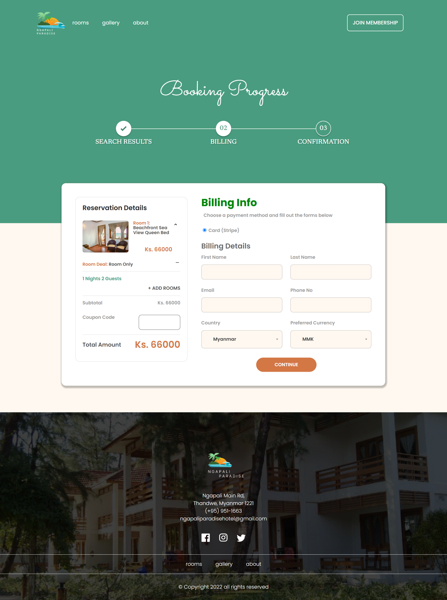
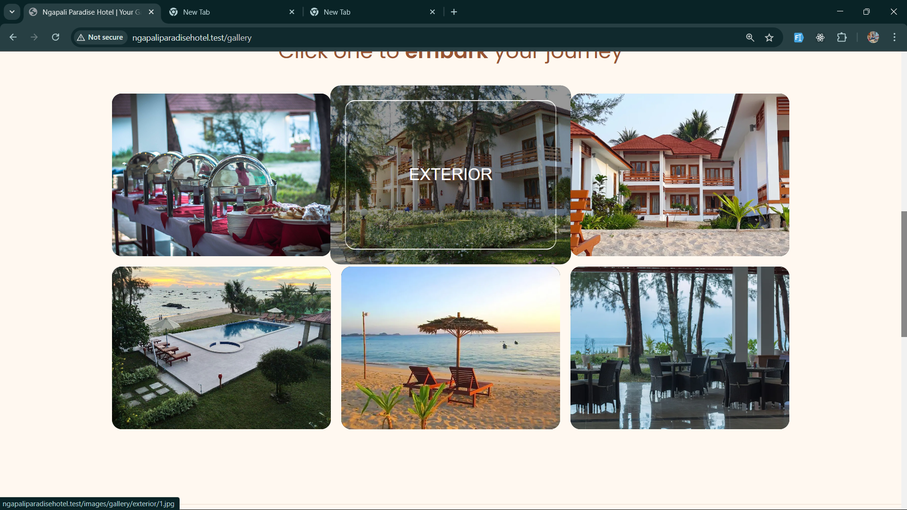
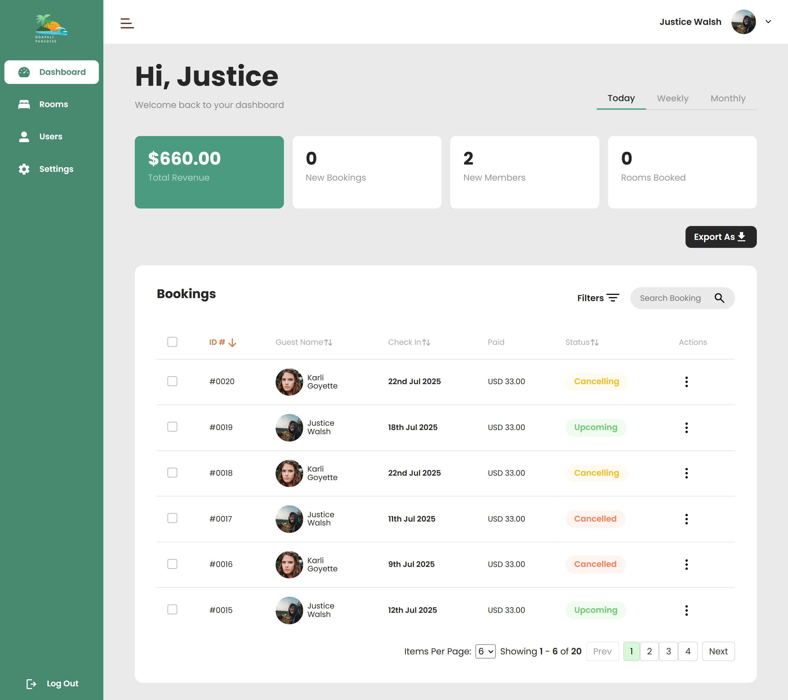
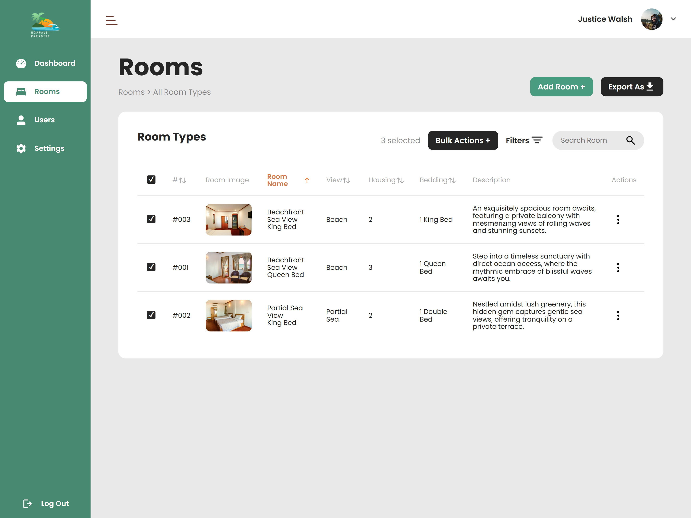

<h1 align="center">🌴 Ngapali Paradise Hotel Reservation System</h1>

<p align="center">
  <i>A full-featured hotel booking experience, built with Laravel & love.</i><br>
  <a href="https://www.figma.com/file/vwrLYsY99At639kmO3F1xt/NgapaliParadiseHotel?type=design&node-id=1088%3A196">
    🎨 View Figma Prototype
  </a>
</p>

<p align="center">
  
  
  
  
  
  
</p>

## ✨ Overview

Ngapali Paradise is a sleek, modern hotel reservation system designed to make the guest experience seamless — from browsing beautiful rooms to completing a secure booking. Built as a final-year bachelor’s project, it combines a responsive front-end, a powerful Laravel back-end, and Stripe integration.
    
## 🖼️ Screenshots

### 👤 Guest Experience

#### 🏖️ Landing Page
<p align="center">
  
</p>

#### 💳 Booking & Payment
<p align="center">
  
</p>

#### 🖼️ Room Gallery
<p align="center">
  
</p>

---

### 🧑‍💼 Admin Panel

#### 📊 Dashboard
<p align="center">
  
</p>

#### 🛏️ Manage Rooms
<p align="center">
  
</p>

---

## 🔧 Features

### 👤 Guest Experience

- 🏖️ Mobile-friendly landing page with room gallery
- 🛏️ Browse rooms with lightbox previews
- 💳 Stripe-integrated secure booking
- 🎟️ Apply promo codes at checkout
- 👤 Personal dashboard with reservation history
- ❌ Cancel reservations before check-in

### 🧑‍💼 Admin Panel

- 📊 Dashboard with booking, room, and user stats
- 🔍 Live tables (Alpine.js) with sorting, searching, and filtering
- 🪟 Modal popups for create/edit actions
- 🖼️ Lightbox image previews
- ⚡ Toast notifications on CRUD actions
- 📂 Export bookings to CSV
- ❌ Cancel or override bookings
- 🔐 Role-based access control for admin-only pages

### 🛠️ System & Dev

- 🧭 Role-based middleware for route protection (admin vs user)
- 🔐 Laravel Breeze authentication
- 🧪 PHPUnit test coverage for booking, auth, and CRUD flows
- ⚙️ Livewire + Alpine.js interactive components
- 🗄️ MySQL for persistent data


## 💡 Tech Stack

| Layer        | Tools Used                         |
|--------------|------------------------------------|
| **Frontend** | SASS, Alpine.js, Livewire          |
| **Backend**  | Laravel, MySQL, Stripe API         |
| **Testing**  | PHPUnit                            |
| **Design**   | Figma                              |

---

## 🚀 Getting Started

### 🛠 Prerequisites

- PHP ≥ 8.0  
- Composer  
- Node.js & npm  
- MySQL  

### 📦 Installation

```bash
# Clone the repo
git clone https://github.com/your-username/NgapaliParadiseHotel.git
cd NgapaliParadiseHotel

# Install PHP dependencies
composer install

# Install JS dependencies
npm install && npm run dev

# Environment setup
cp .env.example .env
php artisan key:generate

# Configure .env (DB, Stripe keys)

# Run migrations and seed data
php artisan migrate --seed

# Start the server
php artisan serve
````

Your app is now available at `http://localhost:8000`.

---

## 🧪 Testing

```bash
php artisan test
```

Includes tests for:

* Booking workflow
* Authentication
* Admin CRUD

---

## 📄 License

This project is licensed under the [MIT License](https://opensource.org/licenses/MIT).


## 📬 Contact

Feel free to reach out if you have questions or want to collaborate:

📧 [paulphyo.dev@gmail.com](mailto:paulphyo.dev@gmail.com) 🔗 [LinkedIn](https://linkedin.com/in/paulphyo19)

